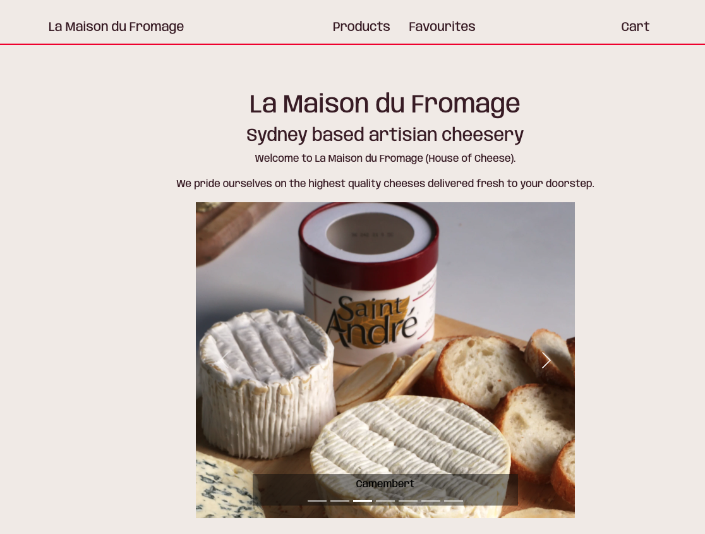
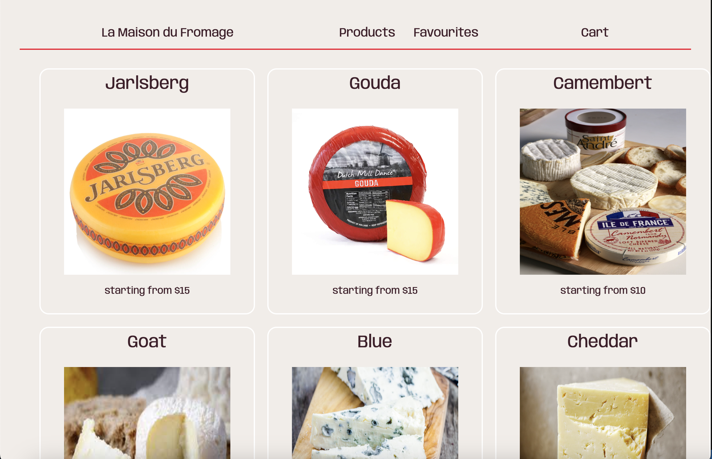
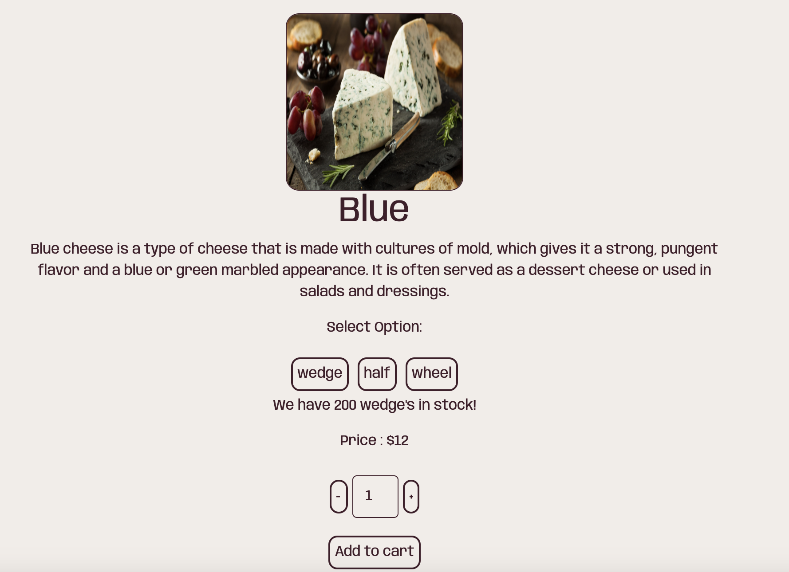

# E-Commerce Cheese Shop

## Github badges - optional for now but strongly reccomended later

- https://betterprogramming.pub/add-badges-to-a-github-repository-716d2988dc6a
- Will need CI
- Most important will be test coverage ones

## Screenshots

_Shop Landing Page with React Bootstrap Carousel_

_Shop Products Page_

_Item Products Page With variants_

## Setup

- To run the app locally, you will need to have Node.js version 12 or higher installed on your machine.

1. Clone the repo
2. Run `npm install` to install the dependencies
3. Run `npm run dev` to start the development server

## Description of project (spec / MVP)

- The website uses React as the frontend framework and Firestore to store the products alongside their relevant data.

- The main goal of this project was to create a simple e-commerce website that allows users to browse and purchase products. The website features a home page with a grid of products and a carousel of featured products, and a product page that allows users to view detailed information about a product and add it to their cart.

## Approach

- The first step in creating this website was to set up the basic structure of the React application and connect it to Firebase.

- Once the basic structure was in place, I began working on the home page, which includes a grid of products and a carousel of featured products, which was achieved through React bootstrap

- I then implemented a navigation component using `React router Dom` alongside a series of `NavLinks`, to create a seemless and consistent user experience throughout the application.

- Next, I implemented the product page, which allows users to view detailed information about a product and add it to their cart. This was achieved on the front end through state and the `useEffect` hook which adds items as objects, which can be altered in the cart.

- I also added a favourites page which allows users to favourite product variants, to which they can revisit, allowing th user the option to add to cart, or remove from favourites.

- I also added a cart system that allows users to keep track of the products they would like to purchase.

- I used Firestore to store the products alongside their information. This allowed me to easily fetch the data using react on the frontend and display it on the website.

## Reflection

- One of the newest things to me was using firestore to store and retrieve data. I relied heavily on the documentation to create custom methods to perform DB operations. One of the biggest challenges i faced with firestore was the lack of some specific functionality which
  required me to create some custom methods.

- An Exmaple of this was, to make changes to a product variants quantity, i was required to pull the entire variants array, which contained objects of variants and carefully replace them as to not change the products ID.

- Additionally State became more complex to manage and it would have been optimal to use context.

- Overall, this project was an awesome learning opportunity for me as I ws able to implement a plethora of technologies to create an application with a fully functioning front and back end. I was able to learn more about react, managing state across different components, And also being able to learn and implement firestore.

## Future Goals

- Add user accounts, authentication
- Add search bar for items.
- Convert to use context.

### Stay in touch

- [LinkedIn](https://www.linkedin.com/in/paramsinghau/)

### Licence

